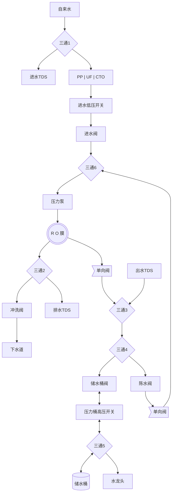

# RO

## 水路设计

```mermaid
graph TD;
    in[自来水]
    out[下水道]
    tap[水龙头]
    filter["PP | UF | CTO"]
    ro((("R O 膜")))
    storage[(储水桶)]
   

    oneWay1>单向阀]
    oneWay2>单向阀]

    tee0{三通1}
    tee1{三通2}
    tee2{三通3}
    tee3{三通4}
    tee4{三通5}
    tee5{三通6}

    inTds[进水TDS]
    outTds[出水TDS]
    drainTds[排水TDS]

    inSen[进水低压开关]
    outSen[压力桶高压开关]

    pump[压力泵]
    storageSw[储水桶阀]  
    inSw[进水阀]
    rinseSw[冲洗阀]
    drainSw[陈水阀]
  

  

tee0-->inTds
in-->tee0-->filter-->inSen-->inSw-->tee5-->pump-->ro

ro-->tee1-->rinseSw-->out
ro-->oneWay2-->tee2-->tee3


tee1-->drainTds

outTds-->tee2
tee3-->storageSw<-->outSen<-->tee4<-->storage
tee3-->drainSw-->oneWay1-->tee5
tee4-->tap


```
